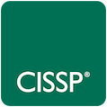
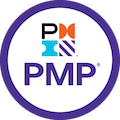
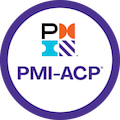
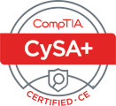
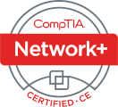
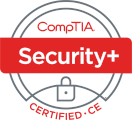
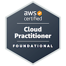
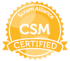

# `whoami`

Ivan Alexander Chubb 
ivanchubb@gmail.com  
Augusta, GA

## Career Summary

Cyber professional with 6 years of experience leading Information Technology teams, developing software, and securing networks. CISSP certified. 

## Work Experience

### DevSecOps Engineer (2024 - Present)

- Project Manager and lead developer for a DevSecOps framework of containers and pipelines that enables over 120 apps, 1000 developers, and 40 organizations
- Responsible for briefing senior leadership on how both policy and technical compliance can be automated

### U.S. Army Cyber Schoolhouse (2021 - 2024)
**Senior Systems Programming Instructor**

- Train early and mid career software engineers in C, Python, Operating Systems, and project management  
- Manage 11 employee team of instructors, cloud resources, and senior leader engagements.  
- Provide technical counsel to unit leadership on new technologies  

### U.S Army 3rd Armor Brigade Combat Team, 4th Infantry Division (2017 - 2021)
**Communications Officer** 

- Ensured robust and secure tactical communications to a 3500 employee organization  
- Developed and managed organization's communication equipment maintenance plan  
- Developed a 20 employee IT team through technical and professional training  
- Acted as Senior technical advisor to organization leadership on all things IT  
  
## Certifications

## Education
**University of Central Florida**  
**B.S. Mechanical Engineering** (Class of 2017)

- Minor in Mathematics

## Computer Languages and Tools

- **Languages**: C, Python, bash, and powershell  
- **Security Tooling**: Syft, Grype, ClamAV, Semgrep, and various tools from Kali's pentesting suite (nc, socat, nmap, wireshark, tcpdump, metasploit, ghidra, burpsuite, gdb... etc)  
- **Windows**: sysinternals, WSL2, Registry, WMIC, IDA Pro  
- **Misc**: git, gitlab CI/CD, docker, virtualbox, cmake, make, gcc, clang, and various SAST/linters/IDEs  

## Additional
- **Hobbies**: [Capture The Flag competitions](https://github.com/ivanchubb/CTF-Writeups) and CAD/3d Printing